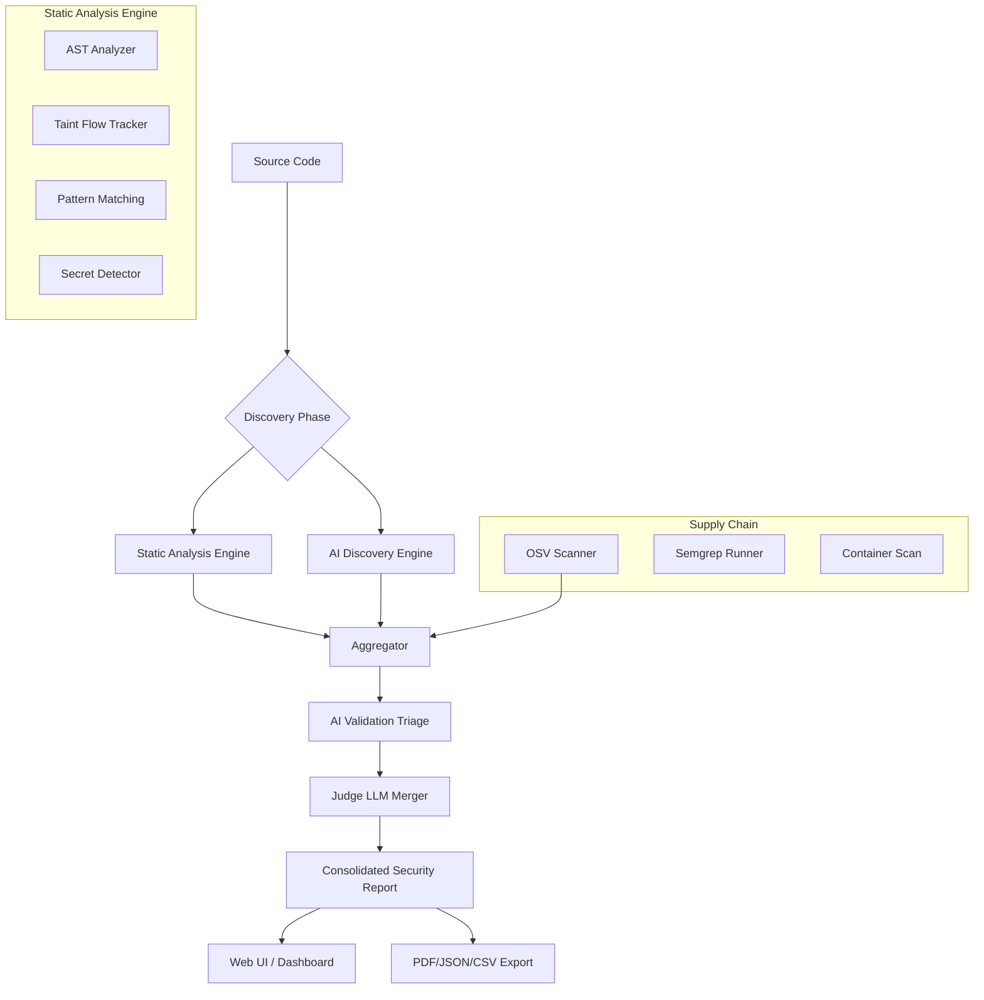

# 🛡️ SentryQ

> **Next-Gen AI-Orchestrated Security Analysis Platform**
> A high-performance, local-first security tool designed for elite engineering teams. Powered by Go and Local AI (Ollama).

SentryQ transforms security scanning from simple pattern matching into **Intelligent Orchestration**. It runs your codebase through **12,400+ static rules** across 60+ languages, performs **AI-driven vulnerability discovery**, and uses a **"Security Judge" LLM** to deduplicate and validate findings—all running 100% locally on your machine.

---

## 🏗️ System Architecture

SentryQ follows a multi-tier analysis pipeline that prioritizes precision and context. It is fully cross-platform (Windows, macOS, Linux).



---

## 🌟 Core Features

| Feature | Technical Breakdown |
| :--- | :--- |
| **🔍 Multi-Engine SAST** | Combines AST-based logic, Taint-flow analysis, and 12,000+ regex-based patterns. |
| **🧠 AI-Orchestrated Triage** | Uses local LLMs (Qwen2.5-Coder) to validate findings (Chain-of-Thought) and suppress FPs. |
| **🌊 Deep Taint Tracking** | Analyzes data flow from user-controlled sources to dangerous sinks across variables and functions. |
| **🛡️ Mitigation Awareness** | AI recognizes secure coding patterns (e.g., `nonce` checks, `path.resolve` guards) to reduce noise. |
| **📦 Supply Chain & SCA** | Integrates Google **OSV-Scanner** and **Semgrep** for dependency and framework-specific audits. |
| **⚖️ Decision Judge** | A specialized "Judge LLM" compares static and AI results to produce a unified, trusted report. |
| **🏢 Triage Dashboard** | Real-time scan updates, finding drill-downs, and a built-in AI Security Chatbot. |

---

## 🔍 Security Engine Deep-Dive

### 1. Taint Analysis & Reachability
Our **[Taint Analyzer](./scanner/taint-analyzer.go)** builds a variable flow graph to see if untrusted input can reach a sink without being sanitized. This is augmented by **[Reachability Analysis](./scanner/reachability.go)** which verifies that the vulnerable code path is traversable in the application's call graph.

### 2. AI Intelligence Layer
The **[AI Layer](./ai/)** operates in three phases: Discovery, Validation (via **[Validator](./ai/validator.go)**), and the **[Judge Engine](./ai/judge_engine.go)** merger.

### 3. Threat Intelligence Enrichment
Findings are enriched via the **[Threat Intel Scanner](./scanner/threat_intel.go)** using MITRE ATT&CK, CISA KEV, and EPSS mapping.

---

## 🏁 Quick Start

### 1. Prerequisites (Platform Specific)

#### 🐧 Linux / 🍏 macOS
```bash
# Ensure Go (1.21+) and Node.js (18+) are installed
# Install Ollama from ollama.com
ollama run qwen2.5-coder:7b

# Install External Scanners
go install github.com/google/osv-scanner/v2/cmd/osv-scanner@v2
pip3 install semgrep
```

#### 🪟 Windows
SentryQ is fully supported on Windows.
1. Install **Go** (1.21+) from [golang.org](https://golang.org/dl/).
2. Install **Node.js** (18+) from [nodejs.org](https://nodejs.org/).
3. Install **Ollama** and run `ollama run qwen2.5-coder:7b`.
4. Install **Python** and **Semgrep** (`pip install semgrep`).
5. Install **OSV-Scanner** (`go install github.com/google/osv-scanner/v2/cmd/osv-scanner@v2`).

### 2. Build & Deploy

#### 🐧 Linux / 🍏 macOS
```bash
chmod +x build.sh
./build.sh
./sentryq
```

#### 🪟 Windows (Native CMD/PowerShell)
```batch
build.bat
sentryq.exe
```

*Access the dashboard at `http://localhost:5336`*

---

## ⌨️ CLI & Configuration

| Flag | Description |
| :--- | :--- |
| `-port` | Web Dashboard port (default: `5336`) |
| `-ollama-host` | Remote Ollama instance (default: `localhost:11434`) |
| `[target]` | Optional: Path to a directory for an immediate CLI scan |

**Configuration**: Edit **[`.sentryq-settings.json`](./.sentryq-settings.json.example)** to configure AI providers (OpenAI/Ollama) and model preferences.

---

## 🤝 Contributing & Extension

- **Core Engine**: See **[`cmd/scanner/`](./cmd/scanner/)** and **[`scanner/`](./scanner/)**.
- **Rules**: Add custom YAML rules to **[`rules/`](./rules/)**.
- **Frontend**: Built with React in **[`web/`](./web/)**.

Run tests via: `go test ./...`

---

## 📄 License

© 2026 SentryQ Security Team.